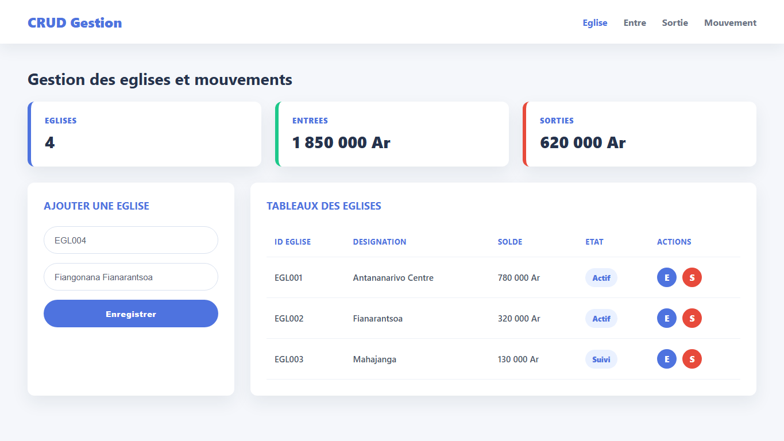

# PHP_Gestion

Application PHP de gestion CRUD avec suivi des eglises, entrees, sorties et mouvements.

## Demo



## Fonctionnalites

- Gestion des eglises
- Suivi des entrees
- Suivi des sorties
- Tableau des mouvements
- Interface Bootstrap avec cartes, formulaires et tableaux

## Lancement local

Configurer une base MySQL `crud`, puis lancer un serveur PHP depuis la racine du projet.

```bash
php -S localhost:8000
```
